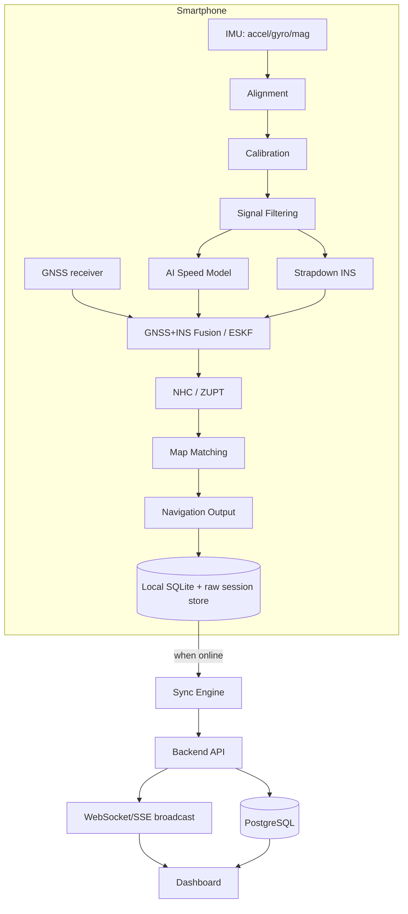
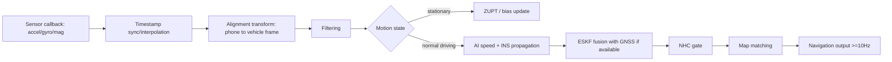
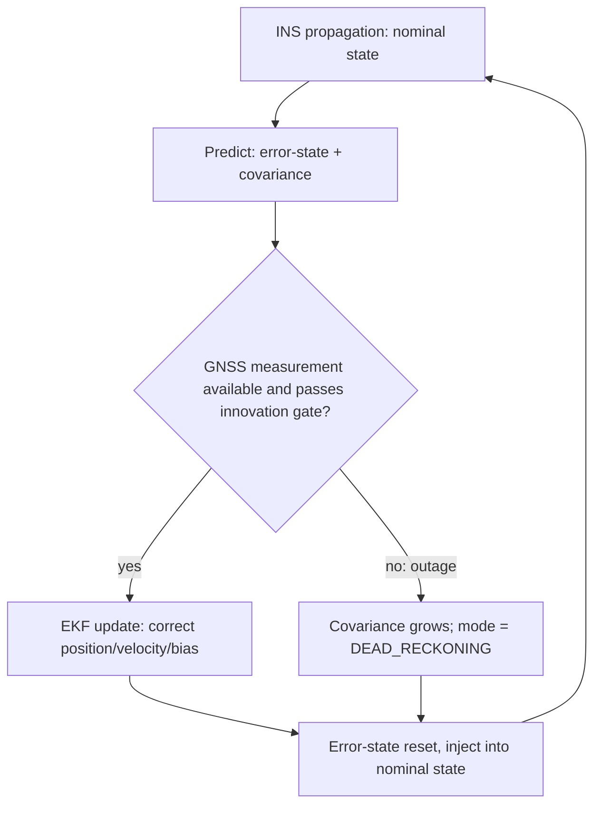
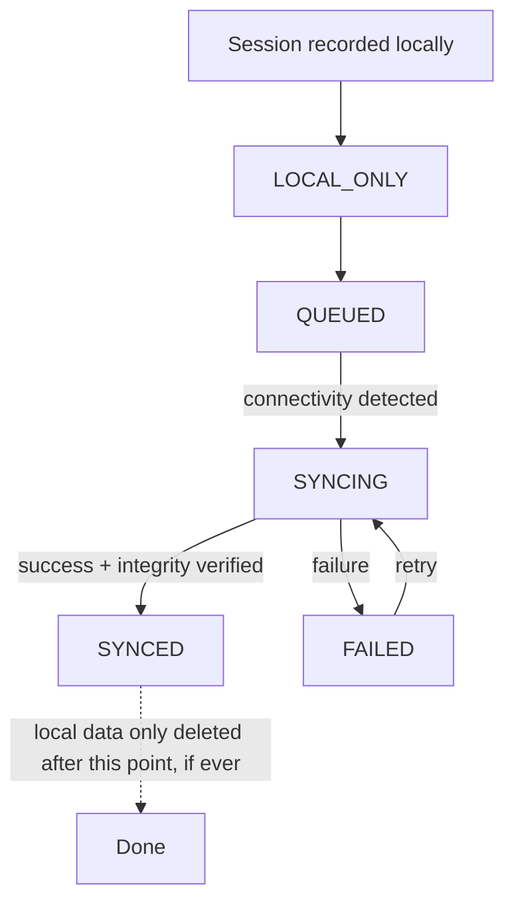
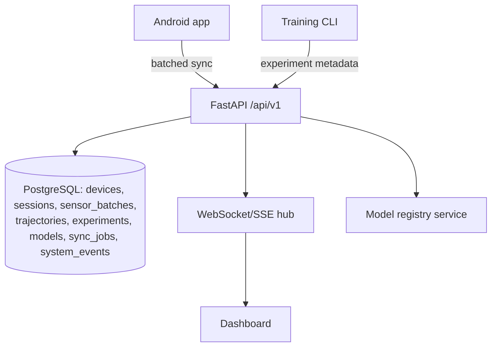
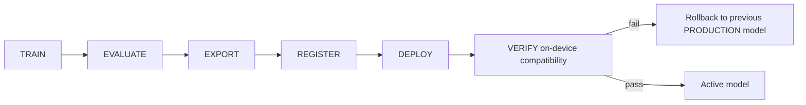
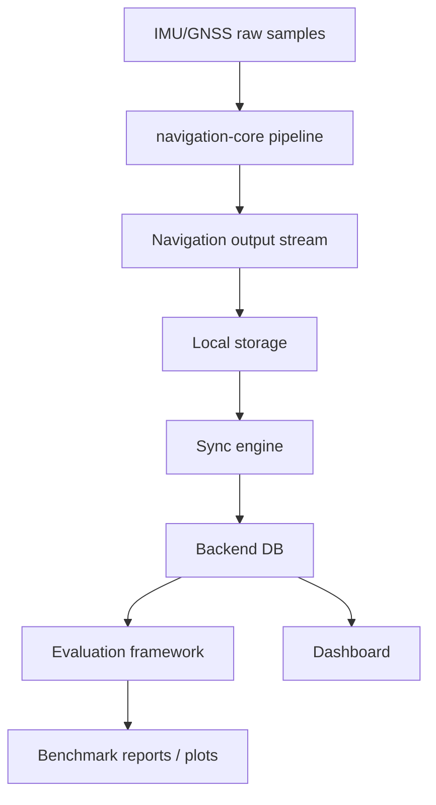

# Navigators — Architecture

## 1. Design principles

- **navigation-core is platform-agnostic.** All INS/fusion/constraint/map-matching
  math lives in one library, consumed identically by the Android app, the edge
  engine, and the offline replay/evaluation harness. This is what makes the
  evaluation numbers trustworthy — the code path under benchmark is the same
  code path that runs live.
- **Classical filtering is the backbone; AI augments it, and only where proven.**
  The ESKF (or chosen filter) is interpretable and always runs. AI components
  (speed model, adaptive covariance, bias correction) are evaluated against a
  classical baseline on the same trajectories before being kept.
- **Offline-first.** Nothing in the navigation, recording, or logging path may
  depend on network availability. Sync is an eventually-consistent side effect.
- **No source of truth duplication.** `docs/REQUIREMENTS.md` /
  `docs/ACCEPTANCE_CRITERIA.md` are the only place "done" is defined; code
  comments and READMEs point back to requirement IDs rather than restating them.

## 2. Technology choices (Phase 0 — subject to revision with justification)

| Layer | Choice | Why | Alternative considered |
|---|---|---|---|
| Navigation core math | Python (numpy/scipy) for research + evaluation; ported to Kotlin for on-device | Python is fastest to prototype/validate filters against IO-VNBD; Kotlin needed for real-time Android execution without a Python runtime on-device | Pure Kotlin from day one — rejected for Phase 0/1 because it slows down the classical-baseline validation work that has to happen before anything else is trustworthy |
| Android | Kotlin, native Android SensorManager + FusedLocationProvider | Direct, low-latency access to raw sensor callbacks; required for ≥10Hz nav loop | Flutter/React Native — rejected, sensor callback latency and threading control are worse |
| On-device ML runtime | TensorFlow Lite (fallback ONNX Runtime Mobile if architecture needs it) | Best-supported mobile inference path from a Python-trained model, small footprint | Running a full TF/PyTorch runtime on-device — rejected, too heavy |
| Backend | Python, FastAPI, PostgreSQL | Matches the ML stack (shared schemas/tooling with training pipeline), async support for streaming telemetry, mature migration tooling (Alembic) | Node/Express — no strong reason to fragment the stack away from Python |
| Dashboard | Web app (framework TBD in Phase 9), WebSocket client | Runs on Mac/desktop browser as required; WS gives real push updates | Polling-only dashboard — rejected, can't show "live" telemetry credibly |
| Map data | Offline-extracted OSM road graph, pre-processed and bundled/downloaded per region | Hard requirement: map matching must work without internet | Live map-tile/routing API — rejected, violates offline requirement |
| Local mobile storage | SQLite (structured) + file-based raw sensor batches | Efficient for high-frequency batched writes, avoids per-sample DB overhead | Per-sample DB rows — rejected for write throughput |

These are Phase 0 defaults, not commitments — each will be revisited with an
explicit "why" if changed once implementation surfaces a real constraint.

## 3. Repository structure

```
navigators/
├── android/                 # Mobile app (Kotlin) — Phase 7
├── navigation-core/         # Platform-agnostic navigation math — Phase 2+
│   ├── alignment/
│   ├── calibration/
│   ├── filtering/
│   ├── ins/
│   ├── fusion/
│   ├── constraints/
│   └── map_matching/
├── ml/                       # Speed model + AI fusion — Phase 4-5
│   ├── datasets/
│   ├── preprocessing/
│   ├── models/
│   ├── training/
│   ├── evaluation/
│   └── export/
├── backend/                  # FastAPI + Postgres — Phase 8
├── dashboard/                 # Real-time monitoring UI — Phase 9
├── edge/                      # External-IMU CLI engine — Phase 10
├── replay/                    # Dataset/session replay + GNSS blackout sim — Phase 1
├── evaluation/                # Metrics, baseline comparison, plots — Phase 1 (harness) onward
├── tests/                     # Cross-component tests
├── configs/                   # YAML configs (training, nav params, sampling rates)
├── scripts/                   # Setup, dataset import, dev bootstrap
├── docs/                      # This file + all other docs
├── docker/                    # docker-compose for backend/db/dashboard dev env
└── README.md
```

Every directory currently contains only a `README.md` stub stating its
status as `NOT IMPLEMENTED` — see `docs/ACCEPTANCE_CRITERIA.md` for what
flips that.

## 4. System architecture (high level)



## 5. Mobile pipeline (per-sample path)



## 6. Sensor fusion detail (ESKF)



## 7. ML pipeline

```mermaid
flowchart LR
    RAW[IO-VNBD + collected sessions] --> PARSE[Parse/validate schema]
    PARSE --> ALIGN2[Timestamp align + normalize]
    ALIGN2 --> WIN[Windowing]
    WIN --> SPLIT[Trajectory-based train/val/test split]
    SPLIT --> TRAIN[Train candidate architectures]
    TRAIN --> BENCH[Benchmark: MAE/RMSE/latency/size]
    BENCH --> SELECT[Select model]
    SELECT --> EXPORT[Export TFLite/ONNX]
    EXPORT --> REGISTRY[Model registry: EXPERIMENTAL]
    REGISTRY --> DEPLOY[Promote to CANDIDATE/PRODUCTION]
```



## 8. Offline synchronization



## 9. Backend architecture



## 10. Model deployment workflow



## 11. Data flow (end to end)



## 12. Coordinate frames (summary — full derivation in `docs/NAVIGATION_MATH.md`, written in Phase 2)

- **Phone frame:** raw sensor axes as reported by Android SensorManager.
- **Vehicle frame:** X forward, Y left, Z up, relative to the vehicle body —
  derived via the alignment estimate (REQ-010).
- **Navigation frame:** local tangent plane (ENU) for position/velocity
  integration; converted to/from WGS-84 lat/lon at the fusion boundary.

Quaternions are used for all internal attitude representation and
propagation; Euler angles are only used at the UI boundary for display.

## 13. What this document intentionally does not yet contain

Per-module class/function-level design, the ESKF state vector and covariance
definitions, and the map-matching HMM formulation are deferred to
`docs/NAVIGATION_MATH.md`, written at the start of Phase 2 once the classical
navigation baseline implementation begins — writing that math before any
data has been loaded and inspected (Phase 1) risks designing against
assumptions the real dataset doesn't support.
